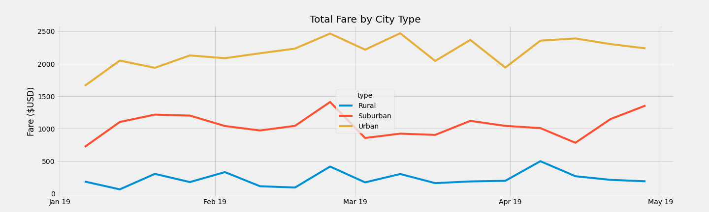

# PyBer Analysis

## Overview of the Analysis 
In this analysis I helped PyBer, a Python-based ride-sharing app, to conduct an exploratory analysis on data obtained from two CSV files. The analysis and visualization are intended to provide PyBer insights to improve ride-sharing services and determine affordability for under-served neighborhoods. In the first part of this analysis in a table, I summarize total rides, total drivers, total fares, average fare per ride, and average fare per driver according to the outcomes for each city type. I conclude my analysis by drawing a line chart for the total fare by city type starting from January 1st, 2019 to April 29th, 2019.

## Results 

### Summary DataFrame 

In this section, I separately analyze each city type according to total rides, total drivers, average fare per ride, and average fare per driver. 

***Table 1: Summary DataFrame*** 

Table 1 shows that there is a clear positive correlation between the city types' population and the total rides, total drivers, and total fares; rising as we go from rural to urban. This is plausible because urban areas are more populated than suburban or rural areas, and since life in urban areas is usually more busy people find it convenient to use applications like PyBer to get to places faster. However, this also means the average fare per ride and average fare per driver is negatively correlated between the city types' population. That is why there is a negative correlation between the city types' population and average fare per ride and average fare per driver; decreasing as we go from rural to urban.

### Total Weekly Fare by City Type 

In this section, from the merged data frame I group 'type' and 'date' using the groupby() function and sum the 'fare' to form a new data frame. I then arrange the new data frame by using the reset_index(), pivot(), to_datetime() and resample() functions to make it look like table 2. 

***Table 2: DataFrame using the "resample()" function by week 'W'*** 

From this new data frame I draw a line chart. 

***Graph 1: PyBer Total Fare by City Type***

Graph 1 proves my statement that there is a positive correlation between the city types population and total fare. Undoubtedly, urban cities have the highest total fare followed by suburban and rural cities according to the data between the weeks of January 1st, 2019, and April 29th, 2019. All three city types see a rise in their total fare values towards the end of February. To delve into the reason behind this I will need to conduct further research. Furthermore, there is not a specific correlation between the city types. The value of total fares steadily increases in urban cities, while for suburban and rural cities it stays relatively the same.
# Summary 

### First Recommendation
To understand why there is a sharp rise for all three city types towards the end of February 2019, I would recommend conducting a thorough study. Then I would use the results from the study to generate insights on how I can increase total fares for other poor-performing months. Furthermore, I will conduct the same research for the poorest performing months for each city type to use the insights generated in those months to see what better strategy can be devised. Concluding both these studies will give the firm an understanding of the market according to months.

### Second Recommendation 
I would recommend drawing a heat map for each city type to see whether the number of drivers in each city type is enough for the demand, and vice versa to see whether there are enough customers for the number of drivers registered. If not, I would devise incentives for either drivers or customers to return to the application more often and work closely with the marketing team to get more people onboard. I would also get instant feedback to improve user experience in using the application and even go further by conducting recurring interviews with a small sample of different customers and drivers each time. On top of this, I would recommend keeping a close eye on the retention and churn rates because that is how any improvement can be noticed. But in doing all this, I would recommend keeping the analysis for each city type separately and devise a personalized business plan for each city type.

### Third Recommendation 

Since each city is bundled into one of the city types, I would recommend analyzing each city type with their cities individually. I would look for trends and outliers. This way the marketing strategy I proposed in recommendation two will make more sense, and will even allow the company resources to be used more wisely.

## Challenges Encountered 
I spent a long time getting the second deliverable done where I had to use Google and also the AskBCS Learning Assistant. But, with each challenge, I am seeing an improvement in searching for the right keywords and asking the right questions. I have come to understand that the process of writing any code is a matter of experimenting and getting instant feedback to change what wrong you are doing.